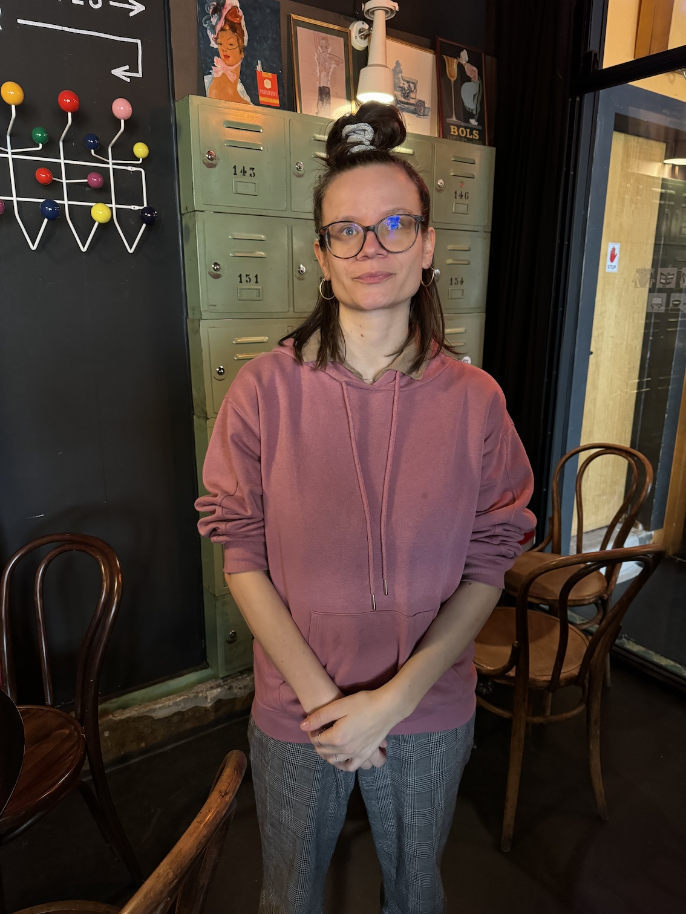

+++
title = "Interview"
draft = false
+++

# Renovate Switzerland, die bekannte Organsisation im Gespräch

## Selina Lerch ist Mitglied und Mediensprecherin der Organisation, sie beantwortet unter anderem Fragen zur Organisation und ihren Erfahrungen im Protest.

<!--StartFragment-->

Die 29-jährige Klimaaktivistin und Mediensprecherin von Renovate Switzerland ist seit März 2022 Mitglied dieser Organisation. In dieser Funktion trat sie bereits in der SRF-Sendung «Arena» sowie in diversen Radio- und Internetsendungen auf. Neben ihrer Mitgliedschaft bei Renovate Switzerland arbeitet sie als Psychomotorik-Therapeutin in Trimbach. Sie ist im Berner Jura in der Nähe von Bellelay aufgewachsen und lebt derzeit in Biel.

<!--EndFragment-->

Café Atomic in Biel, gegenüber des Bahnhofes. Dort fanden früher Veranstaltungen von Renovate Switzerland statt, die alte Bühne im Inneren des Cafés erinnert noch daran. 

**Ist ihre Arbeit bei Renovate Switzerland intensiv?**

Ja, die Arbeit ist intensiv, da ich mit vielen Personen zu tun habe und auch eine Coaching-Rolle für verschiedene Arbeitsgruppen habe. Ausserdem bin ich Mediensprecherin dieser Organisation. Im Pressebüro kommen teilweise sehr spontan Anfragen rein, auch für grosse Auftritte, und da es bei uns gerade in der Deutschweiz wenig andere MediensprecherInnen gibt, fällt bei mir viel Arbeit an, gerade nach Kundgebungen, dann ist das Interesse der Medien besonders gross.  

> **"Gerade nach Kundgebungen fählt bei mir aufgrund von spontanen Anfragen der Medien viel Arbeit an.**

\
**Eine Frage zur Organisation, wie alt sind die Mitglieder von Renovate Switzerland und aus welchen Schichten stammen sie?**

Bei uns ist das Alter der Mitglieder sehr verschieden, von 16 bis 85 Jahren sind alle Altersgruppen vertreten. Von den Personen, die stark involviert sind und entlöhnt werden, deren sieben bei uns arbeiten und zu denen ich seit Kurzem auch dazu gehöre, sind jedoch schon die meisten zwischen 25 und 40 Jahre alt.

**Mit welchen Argumenten können Sie die Leute überzeugen, euch beizutreten und so Mitglieder gewinnen?**

Dies können sehr unterschiedliche Argumente sein, denn die Menschen sind ja auch unterschiedlich. Meiner Erfahrung nach gelingt dies einerseits durch Aktionen, die uns in den Vordergrund rücken und anderseits mit der Gestaltung der Aktionen, nämlich gewaltfrei. Die Demonstranten sind auch ausgebildet auf dem Gebiet der gewaltfreien Kommunikation und können so auch Gespräche und allfällige Streitigkeiten deeskalieren. Parallel dazu ist die Dialogfindung ein wichtiger Bestandteil, um Sympathisanten zu gewinnen. Ein weiteres Argument, das zukünftige Mitglieder anspricht, ist das Leben in der Organisation, wir sind eine Gemeinschaft und organisiert in geteilter Führung.

 **Geteilte Führung, können Sie diesen Begriff kurz erklären?**

Ja, sicher. Die geteilte Führung ist ein Organisationsmodell mit drei Grundpfeilern, in dem das Vertrauen, das Aufbauen von gesunden Beziehungen sowie das sichere Arbeitsklima im Fokus stehen. Ich gehe davon aus, dass dieses Modell viele potenzielle Mitglieder anspricht, da es sich von den Modellen in den Unternehmen, welche nach dem Leistungsprinzip arbeiten, grundlegend unterscheidet. Denn wenn man sich die Symptome des Klimawandels anschaut, ist es ja die menschliche Aktivität, welche dafür schuld ist. Wir wollen immer mehr Ressourcen abbauen und ausbeuten, um an Reichtum zu gelangen, dies führt zu einem grossen Leistungsdruck, welcher das Arbeitsklima in den Unternehmungen in Mitleidenschaft zieht.\
\
**Ja, sehr spannende Ausführungen, aber können Sie noch die drei Grundpfeiler dieses Modells benennen und erklären?**

 Dieses Modell der geteilten Führung besteht erstens aus dem Grundpfeiler der Ganzheit, dies definiert sich daraus, dass man sich selbst sein kann, also so sein kann, wie man ist. Gleichzeitig ist man aber dafür verantwortlich, was sein Verhalten auslöst. Das soll heissen, dass man sich auch emotional ausdrücken und seine Wünsche und Bedürfnisse in einer gewaltfreien Art mitteilen soll. Diese Art zu kommunizieren hat auch einen positiven Effekt, nämlich den Vertrauensaufbau und die Lösung der Konflikte untereinander innerhalb der Organisation.\
Das Zweite Element ist die Dezentralisation. Man kann sich unsere Organisation ein wenig als Organismus vorstellen, der immer weiterwächst und sich ausbreitet, was auch das Ziel eines Organismus, wie zum Beispiel eines Waldes, ist. Die Art, wie unsere Autorität verteilt ist, ist dezentral. Das bedeutet, dass wir nicht in einem hierarchischen Organismus leben, in welchem von oben nach unten diktiert wird, sondern in einem Organismus, in dem es klare Regeln gibt, um wichtige Entscheidungen zu treffen. Zwar haben nicht alle Leute gleich viel Macht, da ja auch gewisse Mitglieder mehr Verantwortung haben, aber diesen Leuten traut man auch mehr zu aufgrund ihrer Erfahrungen. Ausserdem darf jeder seine eigenen Meinungen und Erfahrungen einbringen.\
Der dritte Grundpfeiler ist der evolutionäre Sinn. Wenn wir jetzt wieder zum Beispiel mit dem Organismus zurückkommen, dann kann man sich vorstellen, dass jeder Organismus äusserliche Veränderungen und Spannungen braucht, um sich zu verändern und so der Situation anzupassen. Bei uns gibt es nicht wie bei einem klassischen Unternehmen Ziele für den Zeitraum von Monaten, Quartalen und Jahren, sondern wir passen unsere Ziele der Situation an und überprüfen regelmässig, ob es sich noch richtig anfühlt, anzustreben, die Ziele zu erreichen. Ich möchte nochmals betonen, dass jedes Mitglied neue Vorschläge und auch Vorschläge für die Umsetzung von bestehenden Ratschlägen einbringen kann.\
\
**Dies hört sich alles sehr gut an, jedoch habe ich den Eindruck, dass Renovate Switzerland an Medienpräsenz einbüsst und somit an Reichweite verliert, können Sie das bestätigen?**

Die Medienpräsenz hängt davon ab, welche Prioritäten sich die Organisation setzt. Vor etwa einem Jahr haben wir die Gotthard-Aktion durchgeführt mit dem Ziel, unser neues Logo zu präsentieren und somit unsere visuelle Identität zu verändern. Danach haben wir weniger risikohafte Aktionen wie sogenannte langsame Märsche durchgeführt, welche das Animieren zum Mitmachen an diesen in den Vordergrund stellen, bei denen das rechtliche Risiko nicht so hoch ist. Und bei weniger Aufsehen erregenden Aktionen ist natürlich klar, dass man weniger Medienpräsenz bekommt. Aber es geht ja immer um beide Aspekte, das Begeistern möglichst vieler Menschen und die Medienpräsenz. Man kann den Zustand einer Organisation messen, wenn man untersucht, wie sie polarisiert und wie sie die öffentliche Meinung verändert.\
\
**Sie haben gerade das neue Logo erwähnt, das alte Logo der Organisation erinnerte sehr an Rivella, war das gewollt und gab es Probleme deswegen?**

Ja, das Logo war so gewollt, dass es an Rivella erinnert. Denn wir wollten etwas wählen, das die ganze Schweiz verbindet, Rivella ist so etwas. Es ist typisch schweizerisch und viele kennen es. Plötzlich kam Rivella zu uns und sagte, dass sie nicht wollen, dass wir ein ähnlich aussehendes Logo benutzen. Daraufhin haben wir mit ihnen den Dialog gesucht, eine oder zwei Sitzungen abgehalten und uns darauf geeinigt, unser Logo zu ändern. \
\
**Können Sie mir und den Lesern erklären, was mit «langsamen Märschen» gemeint ist?**

Mit den langsamen Märschen ist gemeint, dass man betont langsam auf den Strassen läuft. Dies soll auch die politische Langsamkeit symbolisieren, mit der das Problem angegangen wird.

\
**Ist es möglich, dass der Grund für den Mitgliederschwund, wenn es denn einen gibt, in der Repression und Androhung von hohen Strafen liegt?**

Zum ersten Teil der Frage, es gibt keinen Mitgliederschwund, im Gegenteil, wir haben unsere Mitgliederzahl in den letzten zwei Jahren von 4 auf ungefähr 250 Personen vervielfacht.\
Zum zweiten Teil, ja, die Repression und Strafen gehören zu den grössten externen Risiken einer solchen Organisation. Die Repression hat eine abschreckende Wirkung und beeinflusst so das Engagement und die Bereitschaft zu Aktionen massiv.

\
**Ich habe gesehen, Sie haben sich schon an vielen Aktionen beteiligt und viele auch selbst organisiert und durchgeführt, hatten Sie in irgendeiner Art Probleme mit der Polizei deswegen?**

Vor Ort habe ich grösstenteils einen freundlichen Umgang mit der Polizei erlebt, deren Aufgabe es ja ist, unsere Proteste zu schützen. Dies ist ein Privileg hier in der Schweiz und auch ein Grund, weshalb ich an so vielen Aktionen teilnehme. Im Nachhinein hingegen wirst du für eine Straftat angeklagt, zum Beispiel bei einer Autobahnblockade für Nötigung, dies resultiert auch in einem Strafregistereintrag. Natürlich gibt es zusätzlich auch Bussen.\
\
**Was ist das Verstörrendste oder Komischste, dass du jemals auf einer Aktion erlebt hast?**

Das war im Kanton Wallis, dort war von unserer Seite ein langsamer Marsch geplant. Wir haben uns dort getroffen, um uns darauf vorzubereiten. Plötzlich kam die Polizei, sie nahm uns diverse Sachen weg, namentlich die Plakate, Gilets, Banderolen sowie die Banner und Flyer. Ausserdem haben sie zwei Personen für die Organisation dieses Marsches verantwortlich gemacht, obwohl dies so gar nicht stimmte. Ich finde das lächerlich. In diesem Moment merkte ich, dass Repression auch so aussehen kann. Es war ein stressiger Moment, da wir unseren Plan ändern mussten, um die Aktion auf eine andere Art durchzuführen.

**Ich habe in der Zeitung von Renovate Switzerland gelesen, dass sie das Bundeshaus orange angesprayt hat, dies erinnert sehr an die Letzte Generation in Deutschland, habt ihr es der Letzten Generation abgeschaut oder Verbindungen zu dieser Organisation?**

Ja, denn wir gehören zur Bewegung «act now» und diese wiederum gehört zum Netzwerk A22. Dort sind international 10 Kampagnen dabei, darunter auch die Letzte Generation aus Deutschland. Diesen Januar hat es eine Konferenz in Paris gegeben, dort haben alle beteiligten Kampagnen teilgenommen und es wurden auch Workshops veranstaltet. Ausserdem tauschen wir uns regelmässig auf Online-Veranstaltungen aus.\
\
**Bekommen Sie aus der Gesellschaft positive Reaktionen auf Ihre Proteste und Aktionen?**

Dies kommt darauf an, wo die Aktion stattfindet und wie disruptiv sie ist. Bei den langsamen Märschen, an denen ich schon mehrere Male teilgenommen habe, habe ich viele positive Rückmeldungen erhalten. Es wurde sogar geklatscht und gratuliert. Bei den Autobahnblockaden hingegen gibt es viele kritische Rückmeldungen, was ja angesichts dessen logisch ist, dass dort die Menschen behindert sind. Aber in der Stadt wird der Verkehr um die Aktion herum in der Regel sehr schnell umgeleitet und es kommt nur zu kurzen Störungen des Verkehrs. 

**Was sagen Sie zur Aussage, dass Autobahnblockaden sogar kontraproduktiv seien für das Thema Klimaschutz, da dies einen hohen Störfaktor hat und die Menschen behindert?**

Ich kann die Erregung deren Leute nachvollziehen, die aufgrund der Autobahnblockade behindert sind. Diesen Leuten erkläre ich dann, warum ich diese Aktionen durchführe und dass es nicht gegen sie gerichtet ist. Eine soziale Bewegung, welche gewaltfrei demonstriert wie wir es sind, polarisiert immer und dies gehört dazu. Ein Beispiel dafür ist Martin Luther King, der verhasst war und am Ende sogar umgebracht wurde. Dass Protest etwas auslöst in der Gesellschaft ist gewollt und normal, und dass nicht nur Zuspruch da ist ebenso. Dies bedeutet aber nicht, dass die Menschen, die unseren Protest nicht unterstützen auch gegen Klimaschutzmassnahmen sind. Denn man ist ja nicht um das Klima besorgt, sieht unsere Proteste und denkt danach, ach nein, wenn so demonstriert wird, bin ich doch dagegen. Dies würde keinen Sinn machen und wäre nicht logisch.\
\
**Als Mitglied von Renovate Switzerland und Klimaaktivistin, sind sie der Meinung, dass Kurzstreckenflüge verboten werden müssen?**

Es braucht Massnahmen in vielen Sektoren für den Klimaschutz. Der Verkehr ist der grösste Co2-Emitent in der Schweiz und dort muss mehr gehen. Gerade beim Flugverkehr ist sehr viel möglich, um Co2 zu sparen.\
\
**Ich habe von Ihnen mal gelesen, dass sie die Aussage getätigt haben, Sie würden für den Klimaschutz in das Gefängnis, stimmt dies immer noch so?**

Zu der Zeit, als ich die Aussage getätigt habe, hatte ich noch keinen Job. Ich habe den Protest ein Jahr unentgeltlich gemacht und keine Beschäftigung nebenbei. Damals hatte ich die Freiheit, jetzt bin ich als Psychomotorik-Therapeutin gebunden und habe mit den Kindern eine Art Beziehung, in der es schwierig wäre, sich ein halbes Jahr zu trennen und ich habe ja auch eine Verantwortung gegenüber dem Arbeitgeber. Aus meinem Herz heraus jedoch würde ich diese Aussage aber wieder tätigen.

>  **"Aus meinem Herz heraus jedoch würde ich diese Aussage aber wieder tätigen."**

\
\
**Was würden Sie anderen jungen Leuten auf den Weg geben zum Thema Klimaschutz und Sorgen um die Zukunft?**

Ich denke, dass man sich mit den Folgen des Klimawandels für die Gesellschaft auseinandersetzen soll und daraus resultierend sollte man sich überlegen, wie man sich engagieren will. Da gibt es verschiedene Möglichkeiten wie das Gründen einer politischen Partei oder den zivilen Widerstand, den ich als Möglichkeit gewählt habe. Ich habe dies gewählt, weil ich finde, dass es jemanden braucht, der aufsteht, da die Zeit abläuft. Man kann auch sonst politisch aktiv sein

> **"ich habe den zivilen Widerstand gewählt, weil ich finde, dass es jemanden braucht, der aufsteht, da die Zeit abläuft"**